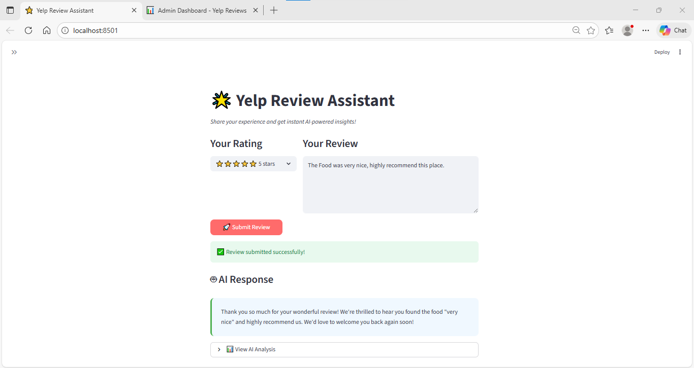
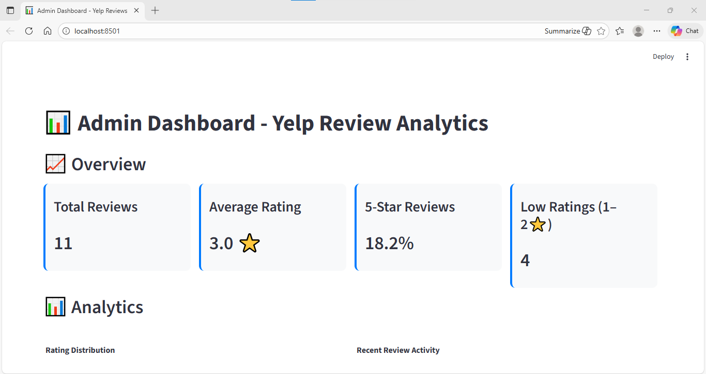

---------------------------------------------------------------------------------------------------------------------
📘 Yelp AI Intern Project

A complete AI-powered Yelp review analysis system built for the Fynd AI Engineering Internship Assessment.
---------------------------------------------------------------------------------------------------------------------

🔥 Table of Contents

Overview

Task 1 — Rating Prediction Notebook

Task 2 — Streamlit Dashboards

Project Structure

Setup & Installation

Running the Dashboards

Generated Reports

Screenshots & Demo

Tech Stack

Notes

License

---------------------------------------------------------------------------------------------------------------------

⭐ Overview

---------------------------------------------------------------------------------------------------------------------
This project includes two major deliverables:

✅ Task 1 — LLM Rating Prediction Experiments

Jupyter Notebook comparing:

Zero-shot prompting

Few-shot prompting

Chain-of-thought prompting

It evaluates:

Accuracy

JSON validity rate

Consistency

Stability

Outputs include tables, charts, and recommendations.
---------------------------------------------------------------------------------------------------------------------

✅ Task 2 — Interactive Dashboards (Streamlit)
User Dashboard

Submit a Yelp-style review → AI generates:

Professional response

Summary

Recommended business action

Data gets stored locally.

Admin Dashboard

View all reviews

Filters + keyword search

Analytics

Plotly charts

AI insights

Export CSV/JSON

LLM: Gemini 2.5 Flash
Storage: Local JSON
---------------------------------------------------------------------------------------------------------------------
📊 Task 1 — Rating Prediction
---------------------------------------------------------------------------------------------------------------------
📄 File → notebooks/task1_rating_prediction.ipynb

Features:

Loads Yelp dataset

Runs 3 prompting strategies

Extracts JSON safely

Calculates performance metrics

Generates:

Comparison tables

Visual charts

Detailed analysis

Example Chart

(Replace after pushing to GitHub)

.png)

---------------------------------------------------------------------------------------------------------------------
🖥️ Task 2 — Streamlit Dashboards
---------------------------------------------------------------------------------------------------------------------
1️⃣ User Dashboard — user_dashboard.py
Flow:

Select rating

Enter review

Gemini generates:

AI Response

AI Summary

Recommended Action

Screenshot:

---------------------------------------------------------------------------------------------------------------------
2️⃣ Admin Dashboard — admin_dashboard.py

Overview metrics

Rating distribution chart

Review activity timeline

Filters + search

CSV / JSON export

AI insights section

Screenshots:

.png)
.png)
.png)
.png)
---------------------------------------------------------------------------------------------------------------------

📂 Project Structure
yelp-ai-intern-project/
│
├── notebooks/
│   └── task1_rating_prediction.ipynb
│
├── src/
│   ├── storage_utils.py
│   └── llm_utils.py
│
├── images/
│   ├── admin_dashboard.png
│   ├── admin_dashboard(1).png
│   ├── admin_dashboard(2).png
│   ├── admin_dashboard(3).png
│   ├── admin_dashboard(4).png
│   └── user_dashboard.png
│
├── reports/
│   ├── prompt_comparison.csv
│   ├── all_experiment_results.csv
│   ├── prompt_comparison_charts.png
│   └── detailed_analysis.txt
│
├── user_dashboard.py
├── admin_dashboard.py
├── requirements.txt
└── README.md
---------------------------------------------------------------------------------------------------------------------

⚙️ Setup & Installation

---------------------------------------------------------------------------------------------------------------------
1️⃣ Create virtual environment
python -m venv venv
venv\Scripts\activate   # Windows

2️⃣ Install dependencies
pip install -r requirements.txt

3️⃣ Add Gemini API key
setx GEMINI_API_KEY "your_key_here"

Restart your terminal.

▶️ Running the Dashboards
User Dashboard
streamlit run user_dashboard.py

Admin Dashboard
streamlit run admin_dashboard.py --server.port=8502
---------------------------------------------------------------------------------------------------------------------

📁 Generated Reports

---------------------------------------------------------------------------------------------------------------------
File	Description
prompt_comparison.csv	Summary of all prompting strategies
all_experiment_results.csv	Full predictions
prompt_comparison_charts.png	Visualization of metrics
detailed_analysis.txt	In-depth reasoning & findings
---------------------------------------------------------------------------------------------------------------------

🖼️ Screenshots & Demo

---------------------------------------------------------------------------------------------------------------------
Include all images:

.png)
.png)
.png)
.png)

---------------------------------------------------------------------------------------------------------------------

🧠 Tech Stack

  ---->  
Category	Tools
LLM  ---->  Gemini 2.5 Flash
Backend  ---->  Python
Dashboards  ---->  Streamlit
Data  ---->  Pandas + JSON
Charts  ---->  Plotly
Notebook  ---->  Jupyter
Analysis  ---->  NumPy, Matplotlib, Seaborn
---------------------------------------------------------------------------------------------------------------------

📝 Notes

---------------------------------------------------------------------------------------------------------------------

Local JSON used for storage

Dashboards auto-refresh

Fallback handling for LLM failures

Safe JSON parsing for predictions
---------------------------------------------------------------------------------------------------------------------

📄 License
---------------------------------------------------------------------------------------------------------------------

Created as part of the Fynd AI Engineering Intern Take-Home Assessment.
---------------------------------------------------------------------------------------------------------------------